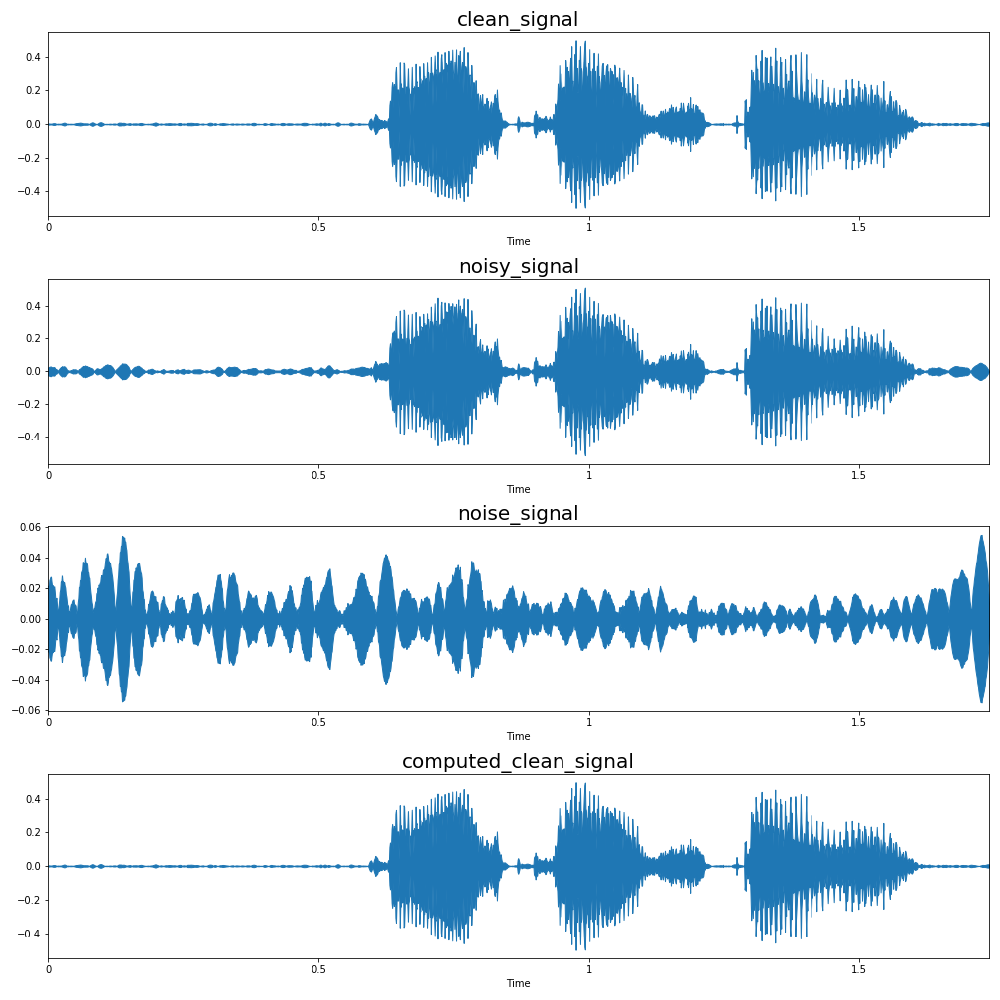
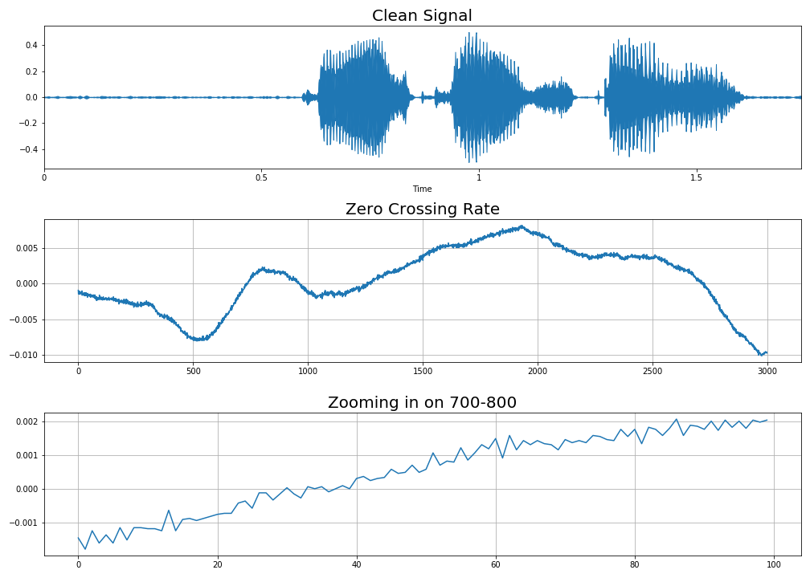

# Are You Noisy Enough?

by  [Chinmay Purav](https://www.linkedin.com/in/puravchinmay/)

# Table of Contents
- [Introduction](#Introduction)
- [Overview of the Data](#Overview-of-the-Data)
- [Feature Selection](#Feature-Selection)
- [Exploratory Data Analysis](#Exploratory-Data-Analysis)
- [Data Pipeline](#Data-Pipeline)
- [Model Selection](#Model-Selection)
- [Conclusion and Next Steps](#Conclusion-and-Next-Steps)

# Introduction

Decades of research has been done in the field of signal processing. This performance saturation has been stirred by the recent advances in Machine Learning and AI. The motivation is to work on a speech enhancement project. It is used in several applications such as hearing aids, teleconferrence systems, VoIP. Traditionally cleaning of audio has been done by statistical signal processing. With machine learning and AI, data-driven ways for the same are being explored.

This aim of this project is to label given audio file as 'Clean' or 'Noisy'. This would assist in the following project of speech enhancement. 

# Overview of the Data

The data was published by University of Edinburgh, UK. The data was made available on 08/21/2017 by the creator, Valentini-Botinhao. The data is made available to train speech enhancement models. The data used consist of 825 clean audio files and 825 noisy audio files.

The following waveplots of the first clean and noisy audio file will provide a visual representation of the background noise,

# Feature Selection

Librosa library was used to extract the features from the audio files. All of the 1650 audio files were individually divided into the following features,

#### Zero Crossing Rate (ZCR):

ZRC is the measure of the rate at which a signal changes the sign. It is recorded on both instances, namely 'positive-zero-negative' and 'negative-zero-positive'. This is an important feature which is used in speech recognition as well as music information retrieval. It is applied to detect whether human speech is present in the audio segment.
The plot shown below will provide a visual representation of how ZCR is calculated,

The first graph shows one clean audio waveplot. The second one is zooming in to observe how many times the signal crosses zero. Even though the second plot shows 4 times, the signal is fluctuating. Hence, further inspection is needed which can be observed in the third plot. 

#### RMSE:

#### Spectral Centroid:

#### Spectral Bandwidth:

#### Spectral Rolloff:

#### Chroma Frequencies:

#### Mel-frequency cepstral coefficients:

# Exploratory-Data-Analysis

# Data-Pipeline

# Model-Selection

# Conclusion-and-Next-Steps

# References

- University of Edinburgh, UK
- Microsoft
