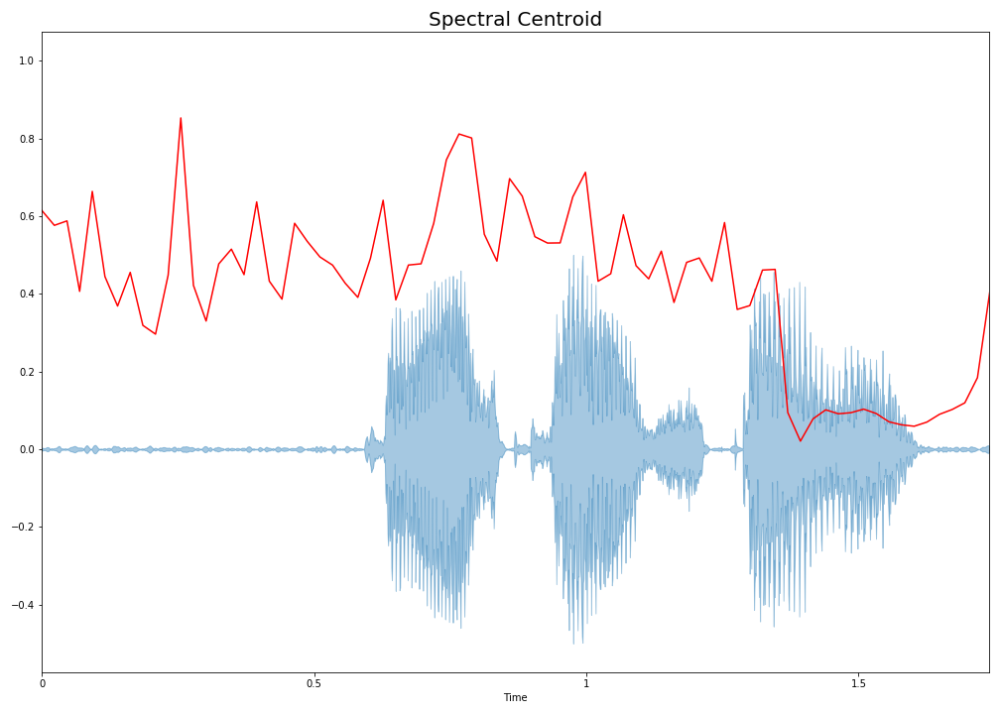
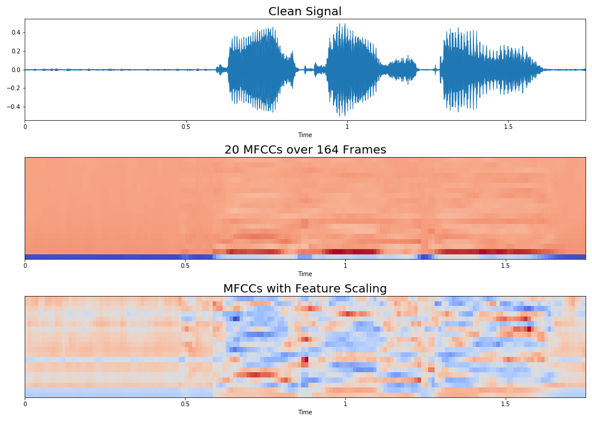
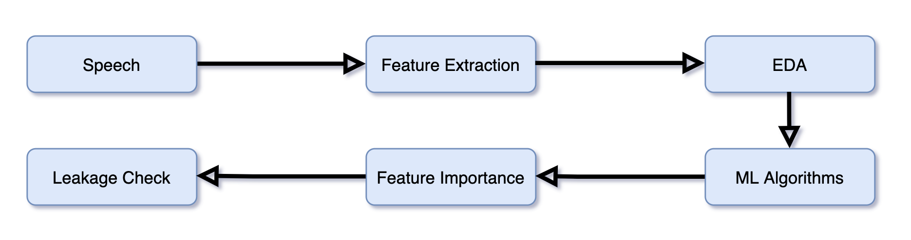
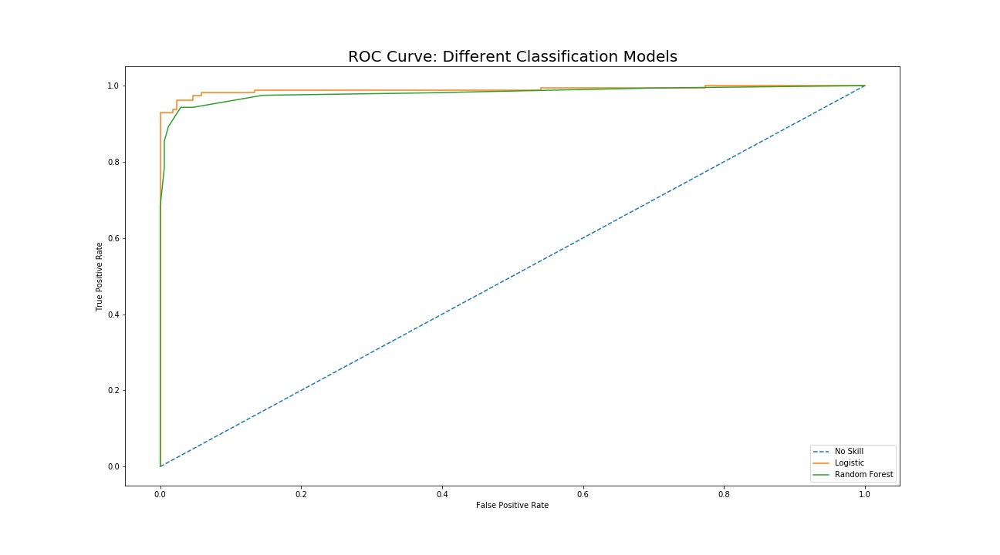
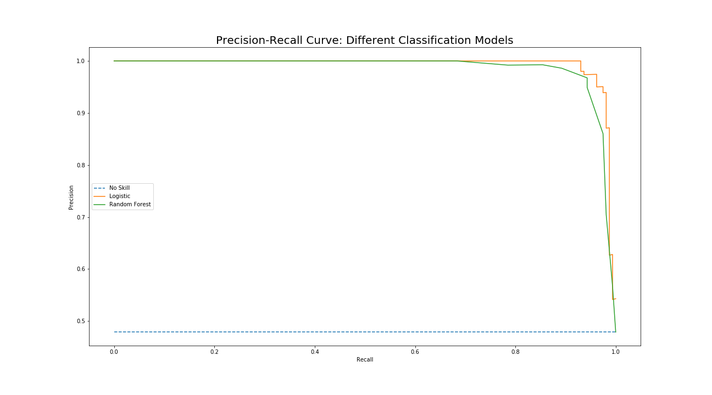
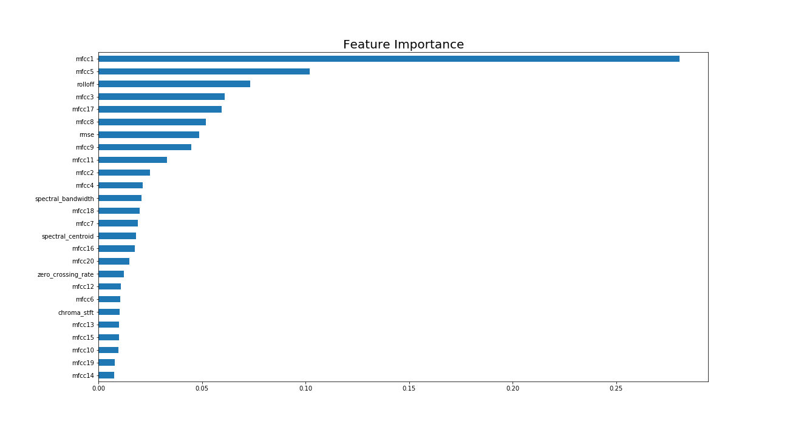
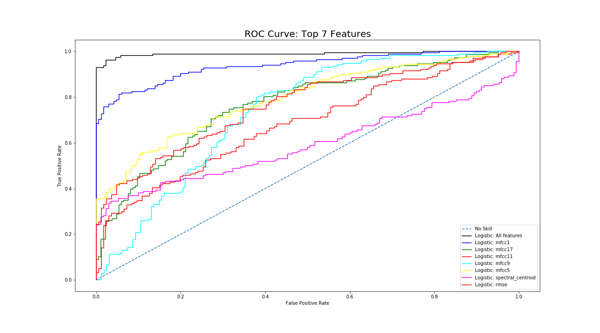
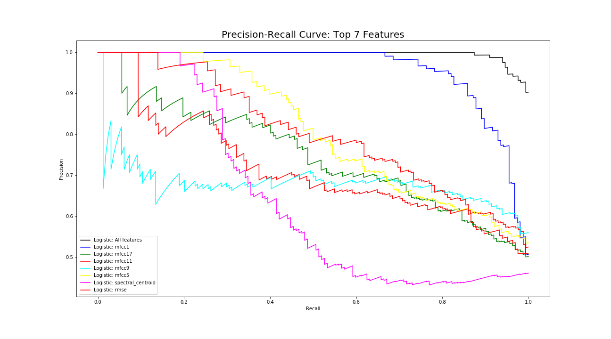

# Are You Noisy Enough?

by  [Chinmay Purav](https://www.linkedin.com/in/puravchinmay/)

# Table of Contents
- [Introduction](#Introduction)
- [Overview of the Data](#Overview-of-the-Data)
- [Feature Selection](#Feature-Selection)
- [Exploratory Data Analysis](#Exploratory-Data-Analysis)
- [Data Pipeline](#Data-Pipeline)
- [Modeling](#Modeling)
- [Leakage Check] (#Leakage-Check)
- [Conclusion and Next Steps](#Conclusion-and-Next-Steps)

# Introduction

Decades of research has been done in the field of signal processing. This performance saturation has been stirred by the recent advances in Machine Learning and AI, where data-driven methods are being explored. It is used in several applications such as hearing aids, teleconferrence systems, VoIP. Traditionally cleaning of audio has been done by statistical signal processing. 

The motivation of this work is to design noisy reduction model. In the first part of the project, the audio files will be classified as 'Clean' and 'Noisy'. In the second part of the project, audio files classified as noisy will be denoised to obtain a clean speech audio file.

# Overview of the Data

The data was published by University of Edinburgh, UK. The data was made available on 08/21/2017 by the creator, Valentini-Botinhao. The data is made available to train speech enhancement models.

The data used in the first part of the project is 28-speaker and 56-speaker datasets where about 400 audio files for each speaker were recorded. The models have been trained on 28-speaker dataset with 56-speaker dataset for testing and vice versa.

The 56-speaker dataset will be used to train the Convolutional Encoder-Decoder for reducing the noise.

To get a feel of what the audio files look like, a visual representation of the first clean and noisy audio files are presented below,

# Feature Selection

Librosa library was used to extract the features from the audio files. For the first part, all of the audio files were individually divided into the following features,

#### Zero Crossing Rate (ZCR):

ZRC is the measure of the rate at which a signal changes the sign. It is recorded on both instances, namely 'positive-zero-negative' and 'negative-zero-positive'. In essence, it measures the dominant frequency of the signal. This is an important feature which is used in speech recognition as well as music information retrieval. It is applied to detect whether human speech is present in the audio segment.
The plot shown below will provide a visual representation of how ZCR is calculated,

The first graph shows one clean audio waveplot. The second one is zooming in to observe how many times the signal crosses zero. Even though the second plot shows 4 times, the signal is fluctuating. Hence, further inspection is needed which can be observed in the third plot. 

#### Spectral Centroid:

Spectral Centroid is one of the features used to characterize specturm. It indicates the balancing point of the spectral ower distribution. It is widely used in digital audio and music processing to measure the perceived sound quality. 

#### Spectral Rolloff:

#### Chroma Frequencies:

#### Mel-frequency cepstral coefficients:

Mel-frequency Cepstrum represents short-term power spectrum of sound. The coefficients collectively form the Cepstrum. The difference between Mel-frequency Cepstrum and Cepstrum is that the frequencies in the Mel-frequncy Cepstrum are equally spaced. This is commonly used in speech recognition.
MFCCs are ensitive to noise in audio. To make them robust, the MFCCs are generally normalized to recognize speech. Another proposed modification is to raise the log-mel-amplitudes to a suitable power before the DCT which reduces the effect of low power components.

In the plots below, the waveplot is of a clean audio. The second graph shows the 20 MMFCCs computed over 146 frames. The third graph shows the same MFCCs but standardized.

In the second half, instead of using MFCCs as the main decomposition factor, STFTs are being used. When using Encoder-Decoder, STFTs are found to restore the features of audio better than MFCCs.

# Exploratory-Data-Analysis

EDA began with identifying how different features contribute differently to the classification.

The first graph above which shows how the spectral factors respond differently for clean and noisy data. Images below display the same for the rmse feature.

MFCC1 is one of the features that caught attention as it has peculiar differences in the classification. This is one of the features that was mainly checked for correlation with the output.

# Data Pipeline

# Modeling

I began the modeling with Logistic Regression and Random Forests. The accuracy for the Logistic Regression was 0.96 while that for Random Forests was 0.95. Shown below are the ROC curves and Precision-Recall curve for both the models.

Concluding from the above plots, I decided to continue with the Logistic Regression Model. To obtain the important features, feature importances were derived using Random Forests. The plot for the same is shown below,

The graph above shows that MFCC1 is definately one of the most important features in this data.

# Leakage Check

The feature importance was run repitatively for 7 times and the most common  7 features that showed up selected. These features were then run through Logistic Regression and plotted ROC and Precision-Recall curves. They are shown below,

These plots above clearly show that there is no leakage as there is no close correlation between the features and the original model curves. Nevertheless, MFCC1 seems to have an heavy influence on the classification of the used data. The accuracy for MFCC1 alone using Logistic Regression seems to vary from 0.81 to 0.88 with an R-square from 0.27 to 0.55.

# Conclusion and Next Steps

xyz

# References

- University of Edinburgh, UK
- Microsoft
